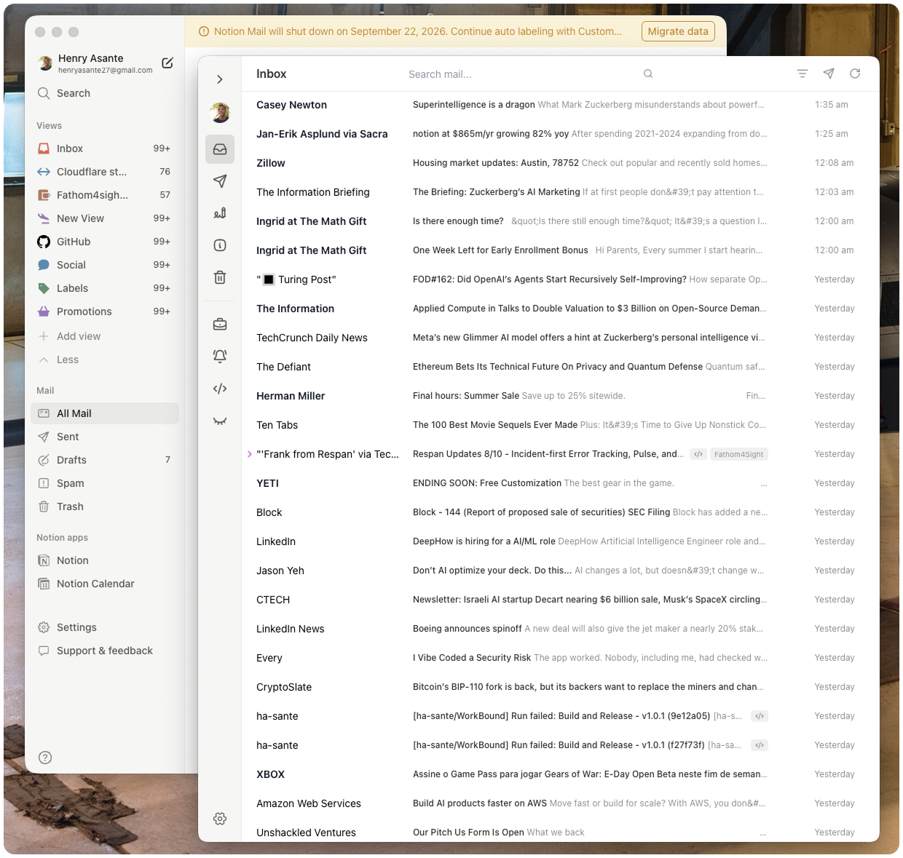

<p align="start">
  
</p>

# WorkBound

1 to 1 Notion Mail replacement - calm email desktop client for business and professionals.
- [Watch Walkthrough Video](https://www.youtube.com/watch?v=oKx7v0hIip4)

<p align="start">
  
</p>

## Download & Installation

> 1. [Download the latest WorkBound release](https://github.com/ha-sante/WorkBound/releases) (.dmg file).
> 2. Open the downloaded `.dmg` file and drag **WorkBound.app** to your **Applications** folder.
> 3. **Do not** open WorkBound yet - macOS Gatekeeper will block it.
> 4. Press **Command + Space**, type **Terminal**, and press **Return** to launch the Terminal app.
> 5. In Terminal, paste the following command and press **Return**:
>
>    ```
>    xattr -dr com.apple.quarantine /Applications/WorkBound.app
>    ```
>
> 6. Now open WorkBound from your **Applications** folder or Finder.

Background: 
> - The app is currently *not notarized* by Apple, so macOS will warn that it "App Is Damaged" or "cannot check WorkBound for malicious software."  
> - This does **not** affect app functionality.  

## App Issue Reports & Feedback

You can easily report issues directly in the App

- It will send to my personal email and i will thread reply you directly.
- You can report public issues here on this github for handling.


## Code Development:

In other to maintain practically & longevity of project - i make these descisions:

- All github issues are auto closed - fetched & prioritised.
- All code flows through me atm - until contributers step in.
- I am the code Testor & QA person to maintain standards.


## Features:

1. Complete Offline Support.
2. Supports 100k plus Inboxes.
3. Regular Email features
4. ...watch the above walkthrough video.

https://appbuilder24.com/verify/

## Roadmap:
- [x] Finish the notion mail 1 to 1 baseline
- [ ] +2 Account Backends Options (cloudflare & workbound native)
- [ ] Multi Account support (full implementation)
- [ ] General App Feature improvements (reminders, scheduled send condition etc.)
- [ ] Fancy core toolbox - (advanced mail control tools box. - nothing intrusive)


## Account Backends:

Gmail:

- You can use self keys or shared keys (default)
- See below to self own everything.

Image & Auth Proxy:

- You can replace the default workbound shared instance i use to proxy your images
- Deploy your own instance & replace the env variable.
- Or Insert the google creds as your env overrides & good to go.


## Limitations, Pricing & Payments

The app is free, however:

- ongoing code signing, image & auth proxying and shared usage of my established google auth keys will cost.
- If you use the default keys, you are welcome to pay the minimum $10 to support it 
- You can access it via Developer -> Get WorkBounded.
